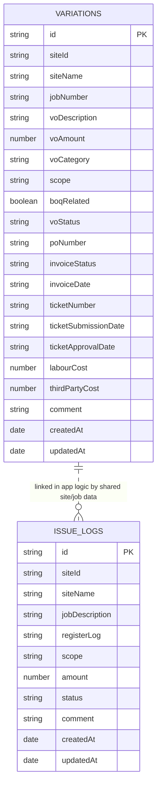

# Database Diagram

Persistence in this app is split across IndexedDB and `localStorage`.

## IndexedDB

- Database: `VariationTrackerDB`
- Version: `4`
- Source of truth: `src/db/indexdb.js`

## Object Stores And Indexes

### `variations`

- Key path: `id`
- Indexes:
  - `siteId`
  - `voStatus`
  - `voCategory`
  - `voAmount`
  - `emailApprovedFromNokia`
  - `siteName`
  - `ticketNumber`
  - `createdAt`
  - `jobNumber`
  - `poNumber`
  - `invoiceStatus`
  - `invoiceDate`
  - `amountChangeFlag`

### `issueLogs`

- Key path: `id`
- Indexes:
  - `siteId`
  - `siteName`
  - `status`
  - `registerLog`
  - `createdAt`

## LocalStorage Map

These keys are part of the persistence model even though they do not live in IndexedDB:

- `currentView` — active SPA view
- `invoicePrepIds` — invoice prep selection set
- `flaggedVOIds` and `flaggedVONotes` — TableView flagged-row state
- `voActivityLog` — VO activity history
- `globalData` — admin sites, categories, scopes, settings
- `siteStatusData` — Site Status records
- `ctdImportHistory` — Cost to Date import history
- `manualInvoiceEntries` — Monthly Invoicing manual lines
- `tv_*` — TableView filters and column-visibility preferences
- `plManualDeductions`, `plManualComments`, `plIncludeCostToComplete`, `plCostToCompleteMonth` — P&L manual state
- `admin_activeTab`, `routineBackupLastRunDate`, and similar view/session preferences

## Notes

- There are no foreign keys in IndexedDB; relationships are inferred in Vue code from shared fields like `siteId`, `siteName`, and `jobNumber`.
- JSON backup/restore covers more than IndexedDB: it exports VO records plus selected `localStorage` state for full app restoration.
- `issueLogs` are persisted in IndexedDB, but the current JSON backup/restore workflow does not include them.
